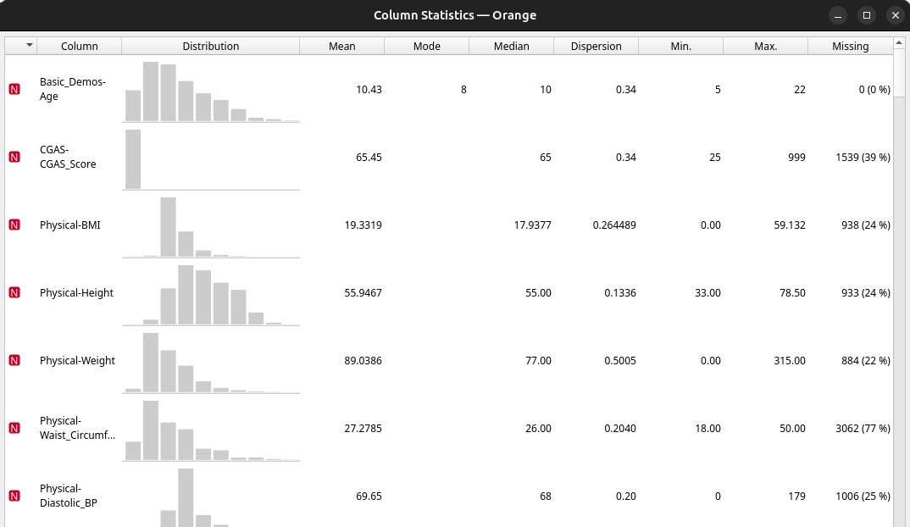
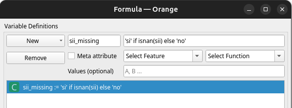
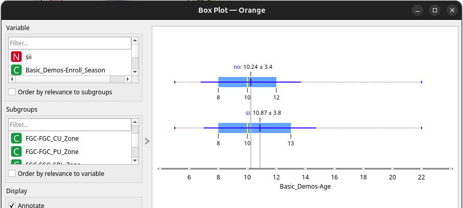
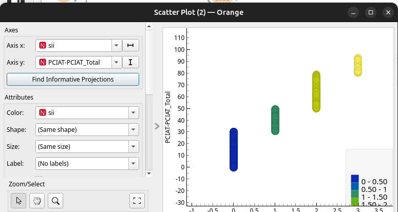

Tenim un dataset extret de Kaggle: https://www.kaggle.com/competitions/child-mind-institute-problematic-internet-use/data

Eixe dataset té dades que no anem a necessitar, dades que falten i dades redundants. Anem pas per pas:

En primer lloc anem a analitzar el dataset amb Orange. El descarreguem, obrim amb el node `File` i `Data Table`.

## Quan falten dades

Descobrirem que falten moltes dades perquè hi ha un `?`. Una millor manera de veure el que falta és amb `Column Statistics`:

Tenim que fer alguna cosa amb les dades que falten, però abans cal preguntar-se el motiu de que falten:

* MCAR (Missing Completely at Random): Les dades falten de forma aleatòria. No hi ha cap biaix. 
* MAR (Missing at Random): Les dades falten per altres variables. Per exemple, els homes decideixen contestar una pregunta menys que les dones. Es poden deduir o eliminar, però poden donar problemes en algorismes de predicció. 
* MNAR (Missing Not at Random): Les dades falten per un motiu específic relacionat amb els valors que falten. Per exemple, el rics no declaren el salari. En aquest cas el dataset tindrà un problema de biaix. Pot ser més interessant crear una nova categoria "desconegut", per exemple.

### Eliminar files

Les columnes més problemàtiques tenen a partir d'un 40% de dades que falten. Però a més, moltes files estan quasi completament buides. En aquest cas el més interessant serà eliminar les files quasi buides que no aporten coneixement, però abans cal asegurar-se de que no estem eliminant un grup hem de fer un `Anàlisi de Comparació de Grups`.

Si després ho passem a un `Box Plot` es veu que no afecta edad o sexe o altres features. Per tant sembla `MCAR` i podem eliminar les columnes que no tenen dades rellevants.

> Per no fiar-te només de l'ull humà, utilitza tests estadístics per comprovar si les diferències són significatives: Per a variables categòriques (Gènere, etc.): Utilitza el Test Chi-cuadrat de Pearson ($\chi^2$). Si el valor $p < 0.05$, vol dir que hi ha una diferència estadísticament significativa entre els grups.Per a variables numèriques (Edat, BMI, etc.): Utilitza el Test de Mann-Whitney U (ja que no sempre podem assumir que les dades són normals). Si el valor $p < 0.05$, les distribucions dels dos grups són diferents.

Per eliminar les files utilitzem un `Impute` amb l'ordre exclusiva d'eliminar si falta `ssi`, que és la columna `target` i sol implicar que falten dades de l'enquesta i altres importants. El resultat ens deixa amb unes 2700 files de les quasi 4000 inicials. En column statistics veurem com totes les columnes han baixat la quantitat de missing, però encara queden algunes amb percentatges molt alts. 

### Eliminar columnes

Partim de unes 80 columnes i moltes d'elles no tenen suficients dades. En aquest moment no sols cal mirar els números, sino el significat de les columnes. Eliminarem les que tinguem més d'un 60% de dades faltants i després les columnes que tinguen valors constants, altament correlacionades i les que no expliquen quasi res de la varianza. Anem per parts:

**Eliminar columnes altament correlacionades entre si o amb el target** 

Ho farem amb `Preprocess`. No obstant, cal assegurar-se de que eixes columnes no tenen una correlació alta amb l'objectiu. L'objectiu, la columna `sii` ja no té dades que falten i podem veure les correlacions amb `Correlation`. Aquest calcula la correlació entre dos columnes del dataset. Les calculem en base a la columna objectiu i podem veure que les preguntes del questionari i el total (PCIAT-PCIAT_Total) éstan molt correlacionades amb el `sii`, ja que aquest sols és una discretització del total. 

Veiem el `Scatter Plot`:

Com es pot veure es solapen algunes categories, així que no hi ha una relació 1:1, però encara hi ha risc de fuga de dades o `leakage`. El model pot aprendre massa ràpid a sols tenir en compte el resultat del qüestionari. Així mateix, totes les preguntes també tenen una correlació alta amb el resultat. Podriem intentar fer `PCA` amb les preguntes per reduir-les a menys variables, però perdíem explicabilitat i pot ser que continuara aquesta correlació forçada. Per tant les eliminarem. 

Si fem la correlació entre totes les variables, veurem que algunes tenen més d'un 90%, això fa que siguen pràcticament la mateixa variable. En especial les que són `BIA-BIA...`. Aquestes no tenen relació directa amb l'objectiu, però si amb elles mateixa. En lloc de posar-les totes, es pot crear una sola variable sintètica (per exemple, mitjançant una PCA o simplement calculant la mitjana estandarditzada) que represente la "composició corporal".

Així que eliminem manualment totes les columnes del qüestionari i fem PCA amb les de BIA:

Elimina columnas constantes o casi constantes: Usa el nodo Preprocess con "Remove empty columns". Si una columna tiene el mismo valor en el 99% de las filas, no aporta nada.

Elimina variables altamente correlacionadas: Si dos variables dicen casi lo mismo (ej. "Precio en euros" y "Precio en dólares"), quédate solo con una. Usa el nodo Correlation para identificar parejas con una correlación cercana a 1 o -1 y elimina una de cada par en el nodo Select Columns.

Rankea y recorta: Conecta el nodo Rank (usando Info Gain o ReliefF). Mira la lista. Probablemente, verás que las primeras 20 variables explican el 90% de la varianza, mientras que las últimas 40 son prácticamente ruido. Quédate solo con las 25-30 mejores mediante el nodo Select Columns.

File (Tu dataset).

Correlation (Elige Spearman si hay mucha asimetría).

Heatmap (Para visualizar visualmente cuáles son redundantes).

Select Columns (Para eliminar manualmente las variables que viste que están altamente correlacionadas entre sí).

Impute (Ahora que tienes menos variables, el imputador trabajará mucho más rápido).

Simple Tree (Entrenamiento).

///// correlacions amb una matriu
 

## Visió general del Dataset

El dataset **Healthy Brain Network (HBN)** és una mostra clínica que inclou aproximadament **5.000 participants d'entre 5 i 22 anys**. El propòsit d'aquest estudi és identificar marcadors biològics que permetin millorar el diagnòstic i el tractament de trastorns de salut mental i d'aprenentatge mitjançant una perspectiva biològica objectiva.

### Objectiu de la competició

L'objectiu principal és **predir el Severity Impairment Index (sii)** de cada participant, una mètrica estàndard que quantifica l'ús problemàtic d'internet.

* **Nota important:** És una competició de codi on el conjunt de test real està ocult. S'ofereixen dades de mostra per estructurar la solució, mentre que el conjunt de test complet conté uns 3.800 participants.

---

## Estructura i tipus de dades

* **Dades Tabulars (fitxers `.csv`):** Contenen la resta d'informació (qüestionaris, mesures físiques, etc.).
* *Nota sobre la qualitat de les dades:* La majoria de les mesures falten per a la majoria dels participants. A més, el valor `sii` (el nostre objectiu) no està present en tots els casos d'entrenament, per la qual cosa podria ser útil utilitzar tècniques d'aprenentatge no supervisat.

---

## Instruments i Mesures

Les dades tabulars inclouen diversos instruments de mesura. A continuació, es detallen les categories principals:

| Instrument | Descripció |
| --- | --- |
| **Demographics** | Informació bàsica sobre l'edat i el sexe del participant. |
| **Internet Use** | Hores d'ús d'ordinador/internet per dia. |
| **CGAS** | *Children's Global Assessment Scale*: escala numèrica sobre el funcionament general. |
| **Physical Measures** | Pressió arterial, freqüència cardíaca, alçada, pes i mesures corporals. |
| **FitnessGram Vitals** | Mesures de fitness cardiovascular (protocol NHANES). |
| **FitnessGram Child** | Avaluació de condició física (aeròbica, força, resistència, etc.). |
| **Bio-electric Impedance** | Composició corporal (BMI, greix, múscul, contingut d'aigua). |
| **Physical Activity Q.** | Qüestionari d'activitat física vigorosa realitzada en els darrers 7 dies. |
| **Sleep Disturbance Scale** | Escala per categoritzar trastorns del son en infants. |
| **Actigraphy** | Mesura objectiva de l'activitat física mitjançant biotracker. |
| **Parent-Child IAT** | Escala de 20 punts sobre característiques de l'ús compulsiu d'Internet. |

### Nota sobre el Target (sii)

El camp `sii` es deriva directament del camp **`PCIAT-PCIAT_Total`** (del qüestionari d'addicció a internet). La relació és la següent:

* **0:** None (Cap)
* **1:** Mild (Lleu)
* **2:** Moderate (Moderat)
* **3:** Severe (Greu)

### 1. La relació és determinista

El `sii` es calcula directament a partir de `PCIAT-PCIAT_Total` segons unes regles (llindars) preestablertes. Per tant, `sii` és simplement una versió "binaritzada" o "agrupada" (categoritzada) de la puntuació original.

* Si coneixes el valor de `PCIAT-PCIAT_Total`, ja saps automàticament el valor de `sii`.
* Matemàticament: $sii = f(\text{PCIAT-PCIAT\_Total})$.

### 2. El perill del "Data Leakage" (Fuga de dades)

Aquest és el punt més important per al teu model: **No has d'utilitzar mai `PCIAT-PCIAT_Total` com a *feature* (variable d'entrada) per entrenar el teu model.**

Si inclous `PCIAT-PCIAT_Total` en els teus vectors d'entrenament per predir el `sii`, estaràs fent el que en *Machine Learning* anomenem **Data Leakage**. El model aprendrà que el `sii` depèn directament d'aquesta variable, i el teu model obtindrà una precisió del 100% (o propera) durant l'entrenament, però **fracassarà estrepitosament** quan intentis predir casos nous on aquesta columna no estigui disponible o quan vulguis generalitzar.

### Què hauries de fer?

* **A l'Entrenament:** Elimina `PCIAT-PCIAT_Total` del teu conjunt de característiques (`features`) abans de passar les dades a l'algorisme.
* **A l'Anàlisi Exploratòria (EDA):** És molt útil utilitzar `PCIAT-PCIAT_Total` per entendre la distribució dels participants, per veure com es relacionen altres variables amb la puntuació contínua, o per veure on es fan els talls per a les categories del `sii`.
* **Gestió de valors nuls:** Com que el `sii` falta per a una part dels participants en el set d'entrenament, si el teu objectiu és fer servir aprenentatge no supervisat o semi-supervisat per omplir aquests buits, potser `PCIAT-PCIAT_Total` és l'única variable que et podria ajudar a "etiquetar" aquells participants que no tenen el `sii` declarat. **Aquest és l'únic escenari on seria útil tenir-la.**

**En resum:** Tracta `PCIAT-PCIAT_Total` com a la "font de la veritat" del target, però mantén-la lluny del procés d'entrenament per evitar que el model faci "trampes".

### 1. El risc de "Data Leakage" s'estén als ítems individuals

Si la columna `PCIAT-PCIAT_Total` és la suma dels ítems `PCIAT_1` a `PCIAT_20`, això vol dir que:

* **No només el *Total* és una fuita de dades:** Les columnes individuals (`PCIAT_1`, `PCIAT_2`, ..., `PCIAT_20`) també contenen, individualment i col·lectivament, la informació que defineix el teu objectiu (`sii`).
* **Conseqüència:** Si entrenes el teu model incloent aquestes columnes `PCIAT_X`, el model "sabrà" la resposta abans d'hora. És el mateix problema que amb la columna `Total`, però més subtil.

### 2. Oportunitats d'Enginyeria de Característiques (Feature Engineering)

Tot i que no les pots utilitzar directament com a *features* per predir el `sii` de manera "tramposa", aquestes dades són molt valuoses si les tractes amb intel·ligència:

* **Imputació intel·ligent:** Si un participant té el `sii` buit (missing), però té respostes als ítems del qüestionari, pots calcular el `Total` tu mateix i, per tant, recuperar la target class (`sii`) per a aquell participant. Això t'ajuda a augmentar el teu conjunt d'entrenament de manera supervisada.
* **Anàlisi de comportament (Clusters):** Potser és més interessant agrupar els ítems en sub-escales (p. ex., ítems que parlen de "compulsivitat" vs. ítems que parlen d' "escapisme"). En lloc d'entrar la suma total, podries crear variables noves que representin aquests comportaments psicològics subjacents. Això podria ser un millor predictor que el `sii` mateix, ja que entens *per què* l'usuari té un ús problemàtic d'internet.
* **Reducció de dimensionalitat:** Podries fer servir una PCA (Anàlisi de Components Principals) sobre els 20 ítems del PCIAT per reduir-los a 2 o 3 components principals. Això captura l'essència de l'addicció sense fer servir directament la variable "target".

### 3. Com gestionar-ho a la pràctica?

Quan netegis el dataset per entrenar:

1. **Identifica les columnes PCIAT:** Crea una llista amb totes les columnes `PCIAT_1` a `PCIAT_20` més la `PCIAT_Total`.
2. **Separa-les:** Aquestes columnes s'han de treure del conjunt de dades d'entrenament (o "X") per evitar la fuga, a menys que estiguis fent el pas de reconstruir les etiquetes perdudes.
3. **Fes servir el `sii` com a guia:** Utilitza aquestes columnes exclusivament per fer un *EDA* (Anàlisi Exploratòria de Dades) o per crear noves *features* que no estiguin correlacionades al 100% amb el target final.

És una observació molt bona, perquè molts competidors sovint passen per alt que les columnes individuals també són "target leakage" i acaben obtenint resultats artificialment bons que no funcionen amb el test real.

## Eliminar les dades que falten

Per saber si el 30% de les dades que vols eliminar representa un grup significatiu o si el fet de faltar les dades és un patró sistemàtic (el que en estadístiques s'anomena *Missing Not At Random*), has de realitzar una **Anàlisi de Comparació de Grups**.

Aquí tens els passos pràctics per fer-ho sense complicar-te massa:

---

### 1. Crea una variable "mask" (màscara)

Crea una columna nova al teu dataset anomenada `es_missing`, on:

* **0** = Participants amb `sii` (el 70% que et vols quedar).
* **1** = Participants sense `sii` (el 30% que vols eliminar).

Això et permetrà comparar tots dos grups amb facilitat en qualsevol llibreria d'anàlisi (com Pandas o Seaborn).

### 2. Compara els perfils demogràfics

El biaix més freqüent és que el grup "missing" tingui una edat o gènere diferent. Compara la distribució dels dos grups:

* **Variables Categòriques (Ex: Gènere):** Fes una taula de freqüències. Si el 60% del grup original són nois, però en el grup `1` (missing) aquest percentatge puja al 80%, ja saps que el teu model "ignorarà" els nois en major mesura.
* **Variables Numèriques (Ex: Edat):** Fes un *Boxplot* o un histograma superposat per veure si les edats són comparables.

### 3. Utilitza tests estadístics de comparació

Per no fiar-te només de l'ull humà, utilitza tests estadístics per comprovar si les diferències són significatives:

* **Per a variables categòriques (Gènere, etc.):** Utilitza el **Test Chi-cuadrat de Pearson ($\chi^2$)**. Si el valor $p < 0.05$, vol dir que hi ha una diferència estadísticament significativa entre els grups.
* **Per a variables numèriques (Edat, BMI, etc.):** Utilitza el **Test de Mann-Whitney U** (ja que no sempre podem assumir que les dades són normals). Si el valor $p < 0.05$, les distribucions dels dos grups són diferents.

---

### Què fer amb els resultats?

Quan facis aquestes comprovacions, et trobaràs en un d'aquests dos escenaris:

#### Escenari A: No hi ha diferències significatives (els grups són semblants)

* **Conclusió:** Les dades falten per atzar (o almenys no seguint cap patró demogràfic).
* **Acció:** Eliminar el 30% és una decisió totalment segura. No estàs introduint cap biaix i el teu model serà igual de robust.

#### Escenari B: Sí que hi ha diferències significatives

* **Conclusió:** El teu dataset té un "biaix de selecció". Estàs descartant, per exemple, els participants més joves o els que tenen unes característiques físiques concretes.
* **Acció:** No vol dir que no puguis eliminar-los, però has de ser conscient que **el teu model només serà vàlid per a la població que sí que va completar l'estudi**. En l'informe final o en l'explicació del teu model, hauries d'especificar: *"Aquest model ha estat entrenat sobre participants que van completar el protocol complet de l'HBN"*.

### Un últim consell d'expert

Abans d'esborrar res definitivament, **fes una prova ràpida**:
Entrena un model molt simple (com una Regressió Logística) on la variable objectiu sigui precisament aquesta `es_missing` (0 o 1).

* Si el model té una capacitat de predicció molt alta (auc > 0.70 o superior), vol dir que **és molt fàcil distingir el grup que falta del grup que tens**. Això significa que els dos grups són molt diferents.
* Si el model no pot predir si una fila té dades o no (té un rendiment proper a l'atzar, auc $\approx 0.50$), vol dir que són indistinguibles i pots eliminar el 30% amb total tranquil·litat.

Quina eina o llenguatge estàs utilitzant per analitzar les dades (Python/Pandas, R, etc.)? Si vols, et puc donar el codi bàsic per fer aquest test de comparació.

4. ¿Cuándo usar PCA en tu caso?

Si después de filtrar variables sigues teniendo 80 y no quieres perder ninguna:

    Normaliza: Es obligatorio (nodo Preprocess -> Normalize).

    PCA: Configúralo para que retenga, por ejemplo, el 80% o 90% de la varianza explicada. Esto te permitirá pasar de 80 variables a probablemente 10-15 componentes.

    Resultado: Tu árbol será increíblemente rápido, pero perderás la capacidad de decir "la variable X es importante", ya que el árbol solo verá "Componente 1, Componente 2...".

Mi consejo final para 3.000 x 80:
No uses PCA todavía. Es "matar moscas a cañonazos" y te complica la vida para interpretar los resultados.

Haz esto:

    Filtra mediante Rank y quédate con las 30 mejores.

    Imputa esas 30 variables usando el método de mediana (vía Python Script si el nodo Impute no te lo da).

    Entrena tu Simple Tree.

¿Has probado a filtrar las variables por importancia antes de pasarlas por el árbol, o estás tratando de entrenar el modelo con las 80 columnas originales desde el principio?