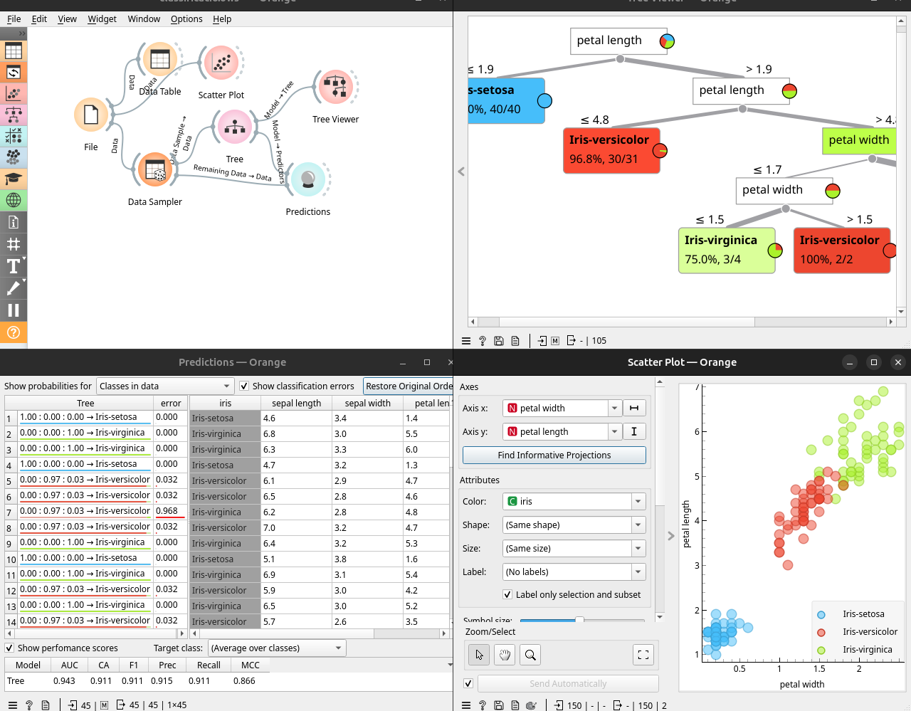
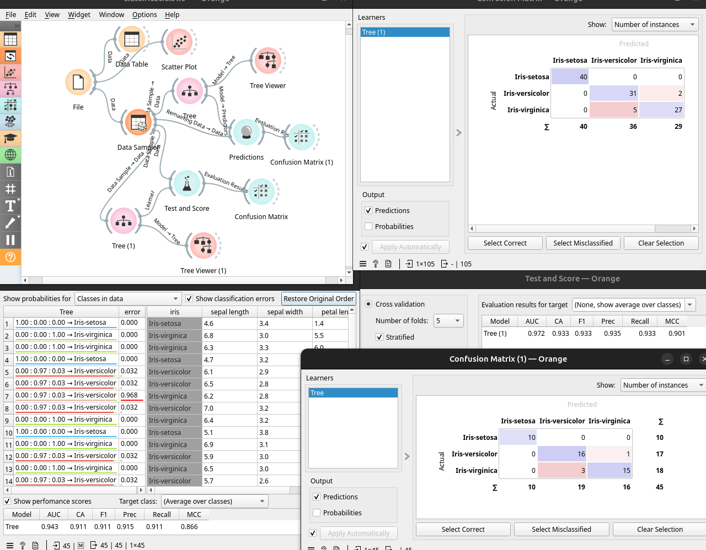

Si agafem el famós fitxer de `Iris` podem fer un model de classificació amb distints algorismes i comparar. 

Per fer l'entrenament podem utilitzar tot el dataset o fer una partició i utilitzar la resta de dades per a test. Com són 150 mostres tenim poca representació per a l'entrenament i pot ser un problema separar dades de test. Veurem maneres de mitigar eixe problema. 

## Tree

L'arbre de decisions és prou potent per tenir resultats acceptables en un dataset tant senzill.  

Provem amb un 70% de train i un 30% de test. Connectem un widget `Data Sampler` al `Tree` i el `Remaining Data` al `Predictions`.

Aquest arbre té bona explicabilitat amb `Tree Viewer`. 

Si connectem un `Scatter Plot` es pot veure com es podrien separar les classes amb varies línies, límits com la longitud del petal >1.9 i dins d'eixes <=4.8... que coincideix amb les decisions de l'arbre. 

L'arbre té varis paràmetres interessants:

* El fet de que siga binari o no.
* La quantitat mínima de instàncies en una fulla o de subdivisions de subsets (per evitar sobre ajust)
* La profunditat màxima de l'arbre i quan parar de fer fulles, si el deixem en el 95% pararà quan represente eixe %. (per evitar sobreajust)

Podríem connectar un altre `Scatter Plot` després de l'arbre per veure a quins registres representa cada branca. 

### Cross Validation

Una millora al model anterior és aprofitar millor les poques mostres fent `Cross Validation`, de forma que l'arbre s'entrena i testa amb totes les dades. Connectem el widget `Test and Score` i podem triar entre `Cros Validation` o `Random Sampling` entre altres. 

Podem fer canvis en les opcions del tree i veure si millora la precisió. Una vegada provats es pot entrenar en totes les dades sense necessitat de separar les de test. 

Amb cross-validation podem deixar menys dades per al test final, ya que es farà test amb totes les dades reservades per a l'entrenament. 

### Avaluar el model

`Test and Score` i predictions ens permet analitzar cóm de bé funciona el nostre model. 

* AUC és area unde the ROC curve.
* CA és classification accuracy.
* F1
* Prec és la precisió. 
* Recall
* MCC Matthews Correlation Coefficient

Ens permet veure quins models i paràmetres funcionen millor en comparativa.

`Confusion Matrix` ens dona una altra perspectiva al veure cóm es comporten entre elles les distintes classes. La diagonal idealment és 100% o la quantitat d'element d'aquesta classe i els altres deurien ser 0. En el nostre exemple 5 de les Virginica has sigut predeides com Versicolor i dos al contrari. Això ens indica uns bons rendiments i que les dos classes es poden confondre de vegades. En les dades de test els resultats són pareguts, això vol dir que l'entrenament ha funcionat acceptablement. 

