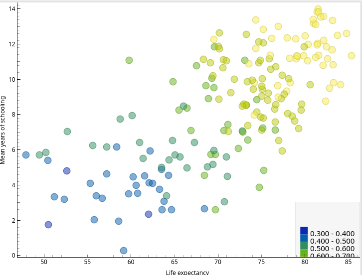
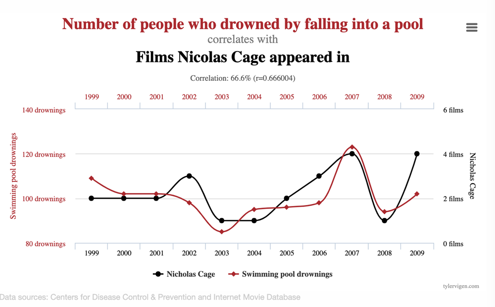
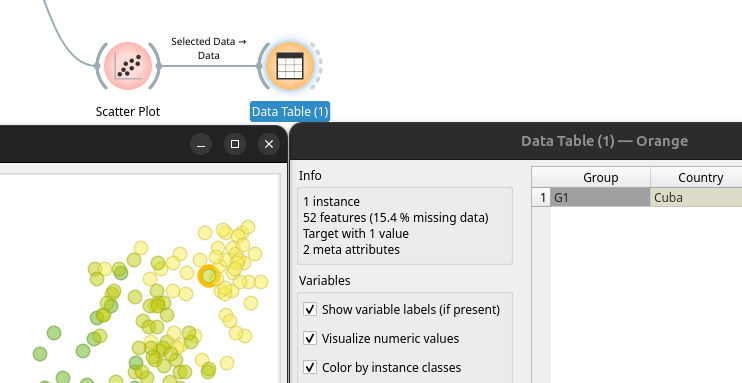
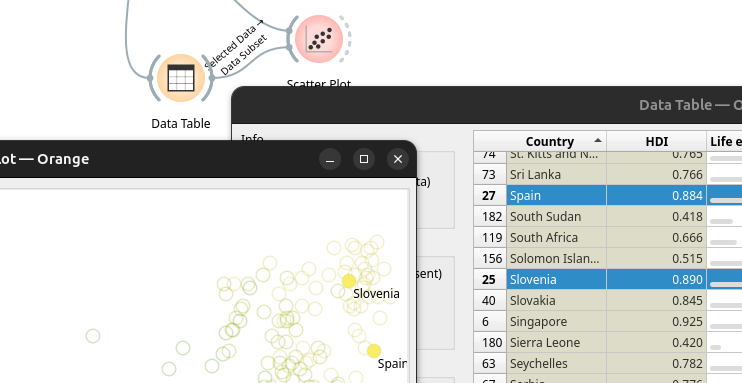
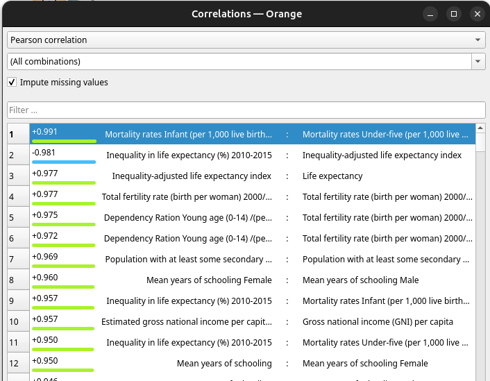
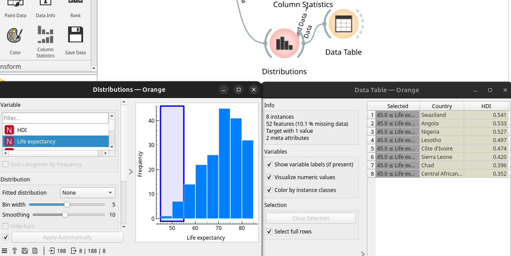
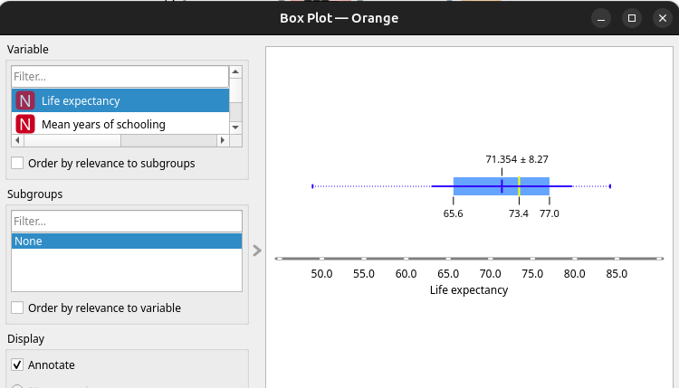
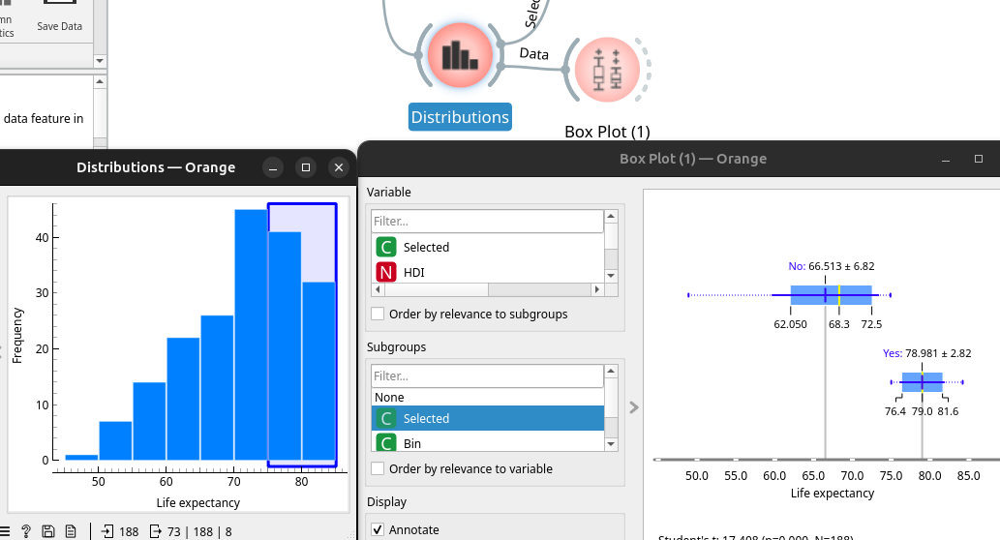
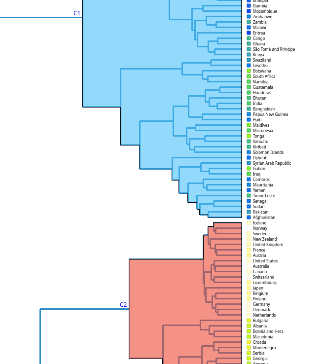
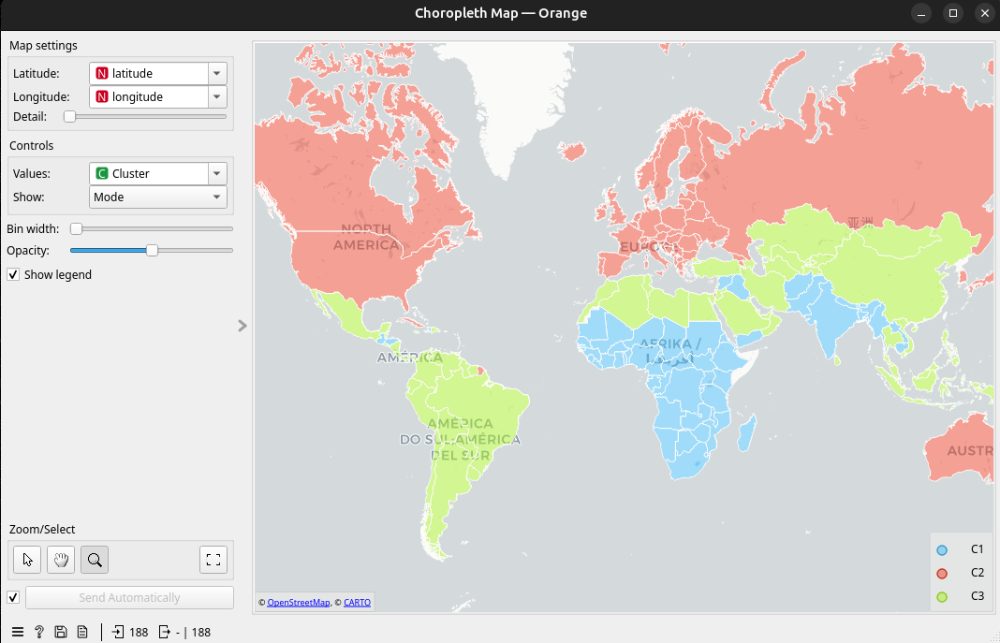

## Explorar les dades

Anem a explorar les dades d'un Dataset del que Orange ens proporciona al seu servidor: HDI, (Human Development Index) Que indica el HDI de cada país i serveix per valorar els motius d'aquest desenvolupament. 

Carreguem el `dataset` i el passem a un `Data Table` on podem ordenar per les columnes i observar les dades: les que falten, dades extremes... O tractar d'endevinar els factors que fan que un país es considere més desenvolupat. Veurem que falten algunes dades i que no sembla que hi ha dades extremes. 

### Primer Scatter Plot

Si connectem amb un Scatter Plot podem comparar variables de 2 en 2. 

Si comparem *Life expectancy* amb *Mean years of schooling* veurem que semblen tindre una correlació. I amés, el HDI va augmentant amb elles. 

Podem pensar que a més anys estudiats, més esperança de vida, però és un error.

> Correlació no implica causalitat. 

El que sembla és que els països més desenvolupats solen tenir més educació i esperança de vida. Per un altre costat és normal aquesta correlació, ja que els dos factors afecten al càlcul del HDI. 

Ens interesen els `outliers`. Encara que no són molt destacats, tenim a Sud Àfrica amb un desenvolupament mig, molts anys d'educació i poca esperança de vida. 

O com a la captura, on veiem a Cuba amb molta esperança de vida i educació, però poc HDI. 

A la captura es pot veure com es pot connectar el `Scatter Plot` a una taula per veure les dades de boles seleccionades. Si volem el contrari, trobar determinats països a la gràfica, ho farem amb dues tables connectades, una amb tots i l'altra amb els seleccionats:

### Correlacions

Si afegim el node `Correlations` al dataset veurem com es correlacionen totes les variables entre elles. 

Algunes són positives i algunes negatives, és a dir, a més d'una variable més d'una altra o a més d'una variable menys d'una altra. 

Fixem-nos en la correlació entre `Inequality in Education` i `Mean years of schooling`. El que fem és correctar les `features` de les correlacions amb les features de la gràfica per filtrar i veiem eixa correlació negativa:

### Distribucions

Per veure si les dades tener distribucions normals, desplaçades cap un costat o altres es pot anar seleccionant per variables i observant. Per exemple, hi ha més països on es viu més que països amb poca esperança de vida.

També es poden seleccionar aquestes barres per veure els països que estan en elles:

Una altra ferramenta és el `Box Plot`. 

Interpretant podem dir que la mitjana és 71.35 anys, la mediana és 73.4, la meitat dels països tenen entre 65.6 i 77 anys. En una ullada podem veure la desviació típica. 

https://orange3.readthedocs.io/projects/orange-visual-programming/en/latest/widgets/visualize/boxplot.html 

Però hi ha alguna cosa més interessant, podem connectar les dues eines. Si passem totes les dades de `Distributions` a `Box Plot` i seleccionem el subgrup de Selected podem veure com per als països no seleccionats, amb menys esperança de vida les dades són distintes que als seleccionats. Fixem-nos en el *No*  i * Yes*  i en les diferències de mitjana i de desviació:

## Agrupacions

Utilitzem el node `Distances` i seleccionem les euclidianes normalitzades (les dades tenen distintes escales). Connectem un `Hierarchical Clustering` en mode `Ward`, ja que troba grups més compactes. Podem observar com els distints clusters pareixen tenir sentit mirant els països i continents.

### Mostrar les agrupacions en un mapa

Descarreguem el addon `Geo`. Connectem el clustering al `Geocoding`, ja que no tenim información de geolocalització i després a `Choropleth Map`.

## Clustering

Si apliquem `k-Means` ens recomana 2 clusters i si els dibuixem son realment molt pareguts al que ja hem calculat amb les distàncies i `Hierarchical Clustering`. 

No obstant, l'objectiu és molt distint. Per un costat al calcular distàncies i dibuixar-les no estem entrenant un model per predir l'agrupament de nous països. Sols estem visualitzant clusters. Amb `k-Means` estem entrenant un model de clustering que podria posar en alguns dels 2 grups un nou país. Amés, és molt més eficient amb grans quantitats de dades. 

