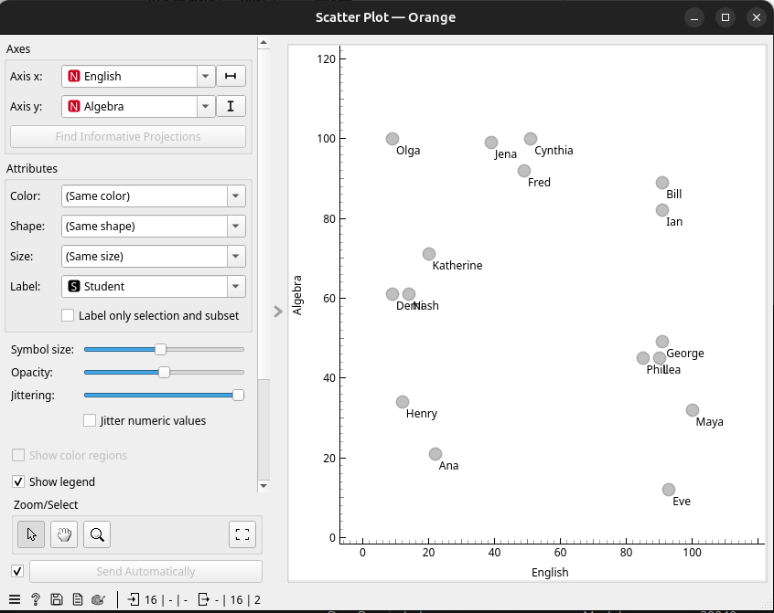
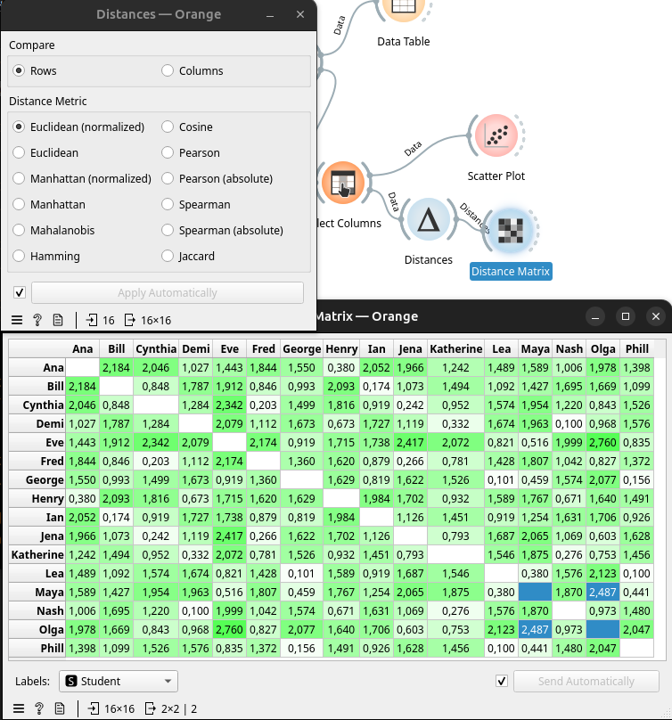
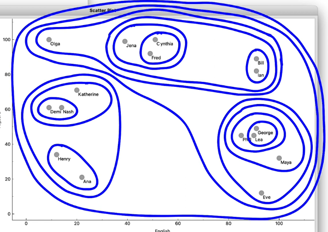
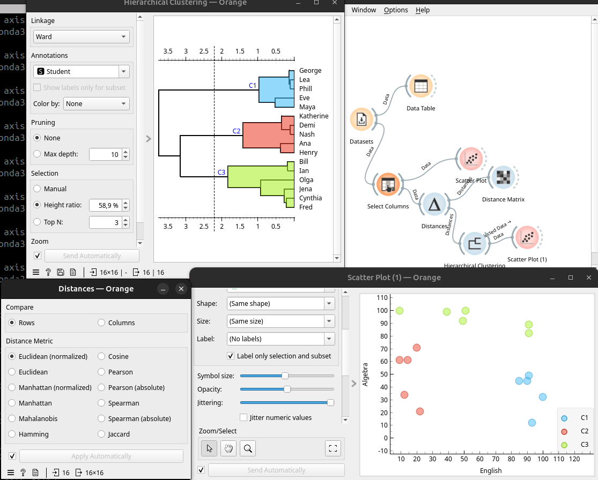
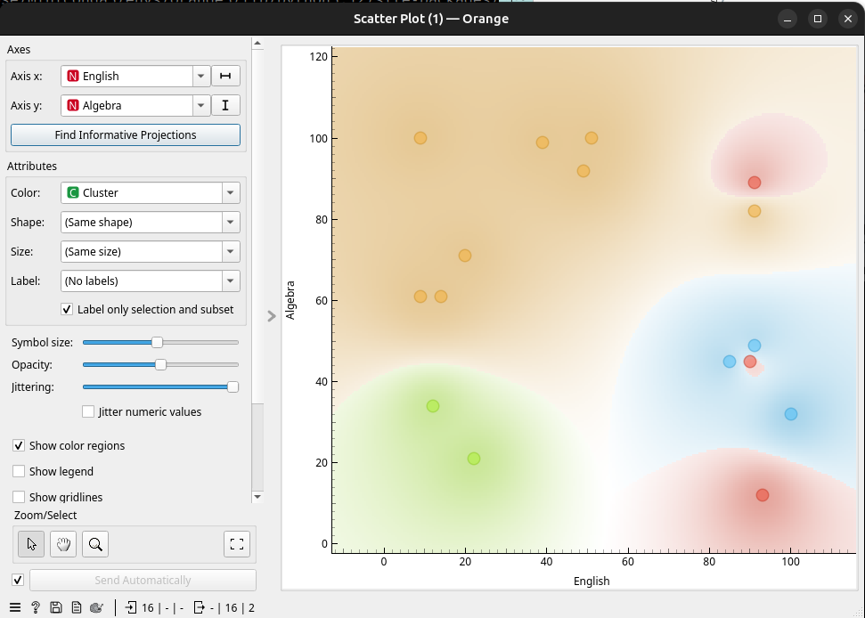
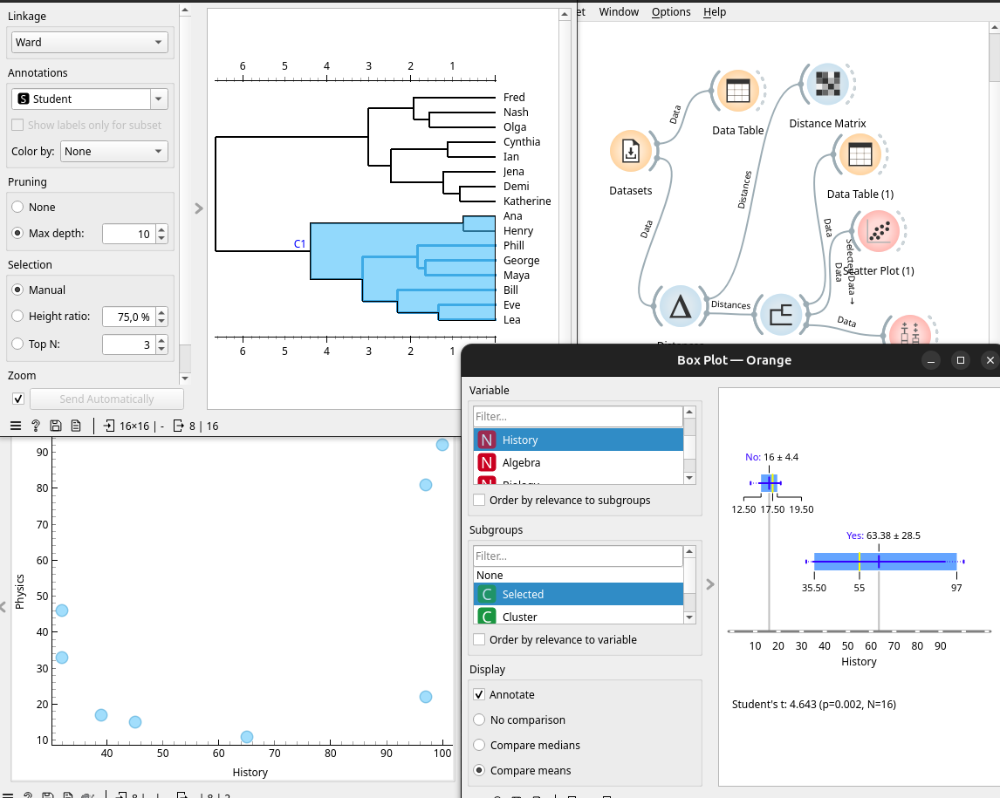

## Distàncies

El `Clustering` és detectar automàticament agrupacions en les dades. 

En Orange començarem calculant les distàncies.

Primer descarreguem el `Dataset` `Course Grades`. Que conté les notes de 16 alumnes alumnes. 

Com a professors ens interessa saber si hi ha alumnes amb talents en diferents àrees. 

### Distàncies en 2D

Com hi ha més de 2 assignatures tenim que llevar columnes amb `Select Columns` i deixar soles Anglès i Àlgebra. . Això ho passem a un `Scatter Plot` i vorem com *Olga*  i *Maya* estan en els extrems oposats de la gràfica amb molt bona nota en una i molt mala en una altra. 

També vorem que hi ha com agrupacions d'alumnes similars en eixes dos variables. 

Com que estem a una gràfica 2D, podríem mesurar la distància en mm d'una a altra o, treure per Pitagoras la distància a partir de la diferència en l'eix X i Y.

Per no calcular-les totes a mà, Orange ens proporciona `Distances` i `Distance Matrix`:

Amb una distància euclidiana normalitzada o no (en aquest cas no és necessari perquè són les mateixes unitats) vorem que Olga i Maya estan molt distants. Podem comparar elles o altres en el `Scatter Plot` anterior. 

### Cluster per distancies

La idea dels clusters és trobar grups d'estudiants amb distàncies menudes entre ells. Hi ha varis algorismes per a això. 

Si ho férem a mà, seleccionariem els que visualment estan més prop en grups de 2 i aniriem ampliant eixos grups amb un més que estiga prop del cercle del grup. 

En algún moment s'unirien grups per proximitat, però és més complicat calcular la distància d'un grup que d'un element. El que podem fer és: 

- Calcular totes les distàncies individuals i calcular la mitjana (Average linkage)
- Calcular la distància dels dos elements més propers (Single Linkage)
- Calcular els més llunyans (Complete Linkage)

La ferramenta d'Orange per a fer això és el *Dendograma*, anomenat `Hierarchical Clustering`. Aquest el podem connectar al `Scatter Plot` per veure cóm queden els clusters:

El resultat és distint si calculem distàncies normalitzades o no. També és distint si calculem el `linkage` com a `Average`, `Ward` o altres. Per a grups sòlids `Ward` o `Average` són bons, per a formes llargues `Single` les detecta millor. `Complete` és un punt mig. 

### Clusters en més dimensions

Les distàncies ja no són triangles rectangles 2D, ara tenen moltes dimensions, però el càlcul és el mateix.  

Si connectem `Distances` directament al `Dataset` calcularà les distàncies entre tots els parells de dades. Si ho connectem al `Hierarchical Clustering` el resultat ja serà més complicat d'interpretar. Ara pareixen desordenats, però sols és perquè no mira sols anglès i àlgebra, mira totes les demés

De fet si polsem `Find Informative Projections` vorem que les que més informen del clustering són història i física i que els grups no pareixen tant dispersos.

### Explicar els clusters

Ens interessa saber quins factors afecten més a l'hora de clavar un estudiant en un clúster o un altre. Connectem per `Data` el cluster amb `Box Plot` i el subgrup selected. Així veurem en cada grup els valors de cada assignatura. 

Pel que sembla, aquest grup té una bona mitjana en història, però amb una gran desviació. Si triem el subgrup Phil, George, Maya, tenen un 90 quasi exacte. Els altres subgrups tenen menys nota, però més que els no seleccionats. Per tant, podem dir que aquest és un dels criteris. 

Di seguim mirant, veruem dos grans grups de "lletres" o "ciencies" i un grup menut d' "esports"

Baix del `Box Plot` apareix el factor `t` que indica la diferència entre la seua distribució en el clúster i la de fora del clúster. Un `t` alt indica que aquesta variable és important en aquest clúster. 

