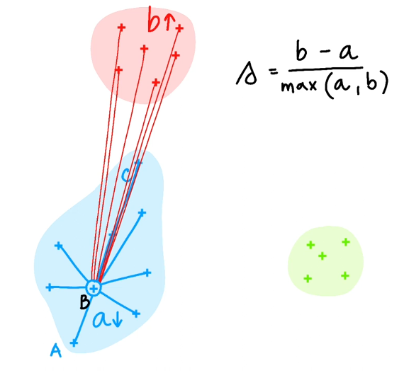
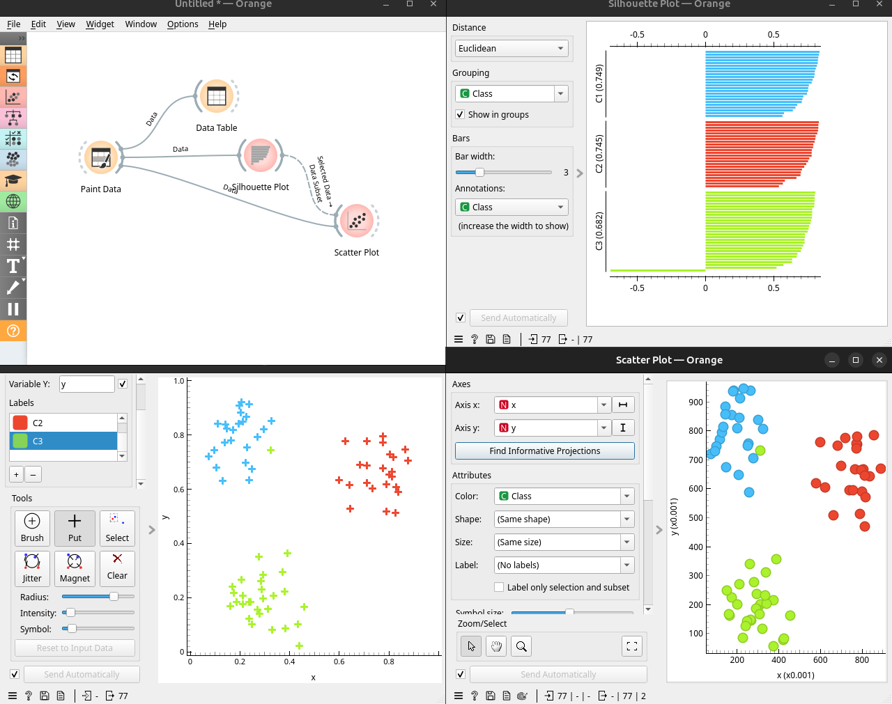
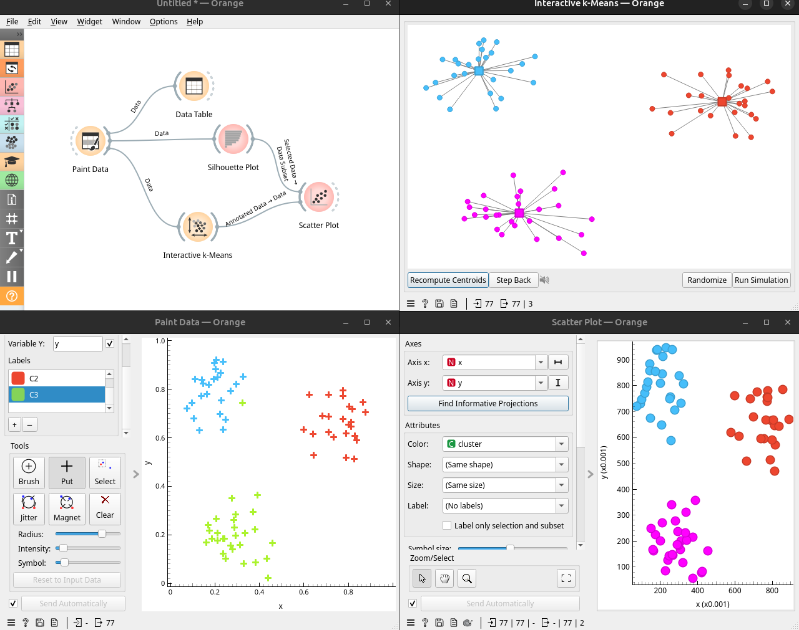

# Clusters

Quan tenim les dades representades en 2D i veiem grups clars, podem intuïtivament detectar els agrupaments. Amés, podem intuir si un punt està més cap al centre del grup que altres. Per medir aquesta pertinença a un grup en termes matemàtics es pot fer mesurant la distància a cada membre del grup i calculant la mitjana. Si la mitjana és menuda comparada en altres es considera que el punt és central al seu cluster.

Si calculem la mitjana del seu cluster (`a`) i la mitjana de distància d'un punt respecte a un altre cluster (`b) podem treure la diferència i normalitzar per el més gran:

(b-a)/max(a,b)

Aquest valor es diu la `silueta` del punt. Com que l'altre cluster està lluny, `b` serà major que `a` i el resultat será menor que 1. Per a punts centrals `a` serà molt menut i la silueta serà quasi 1. Un grup molt lluny d'altres també provoca siluetes properes a 1, encara que no siga molt compacte. 

Aquells punts que no están prop de cap grup es diuen `outliers` o valors atípics. Els outliers tenen una silueta molt pròxima a 0. Si és negatiu és perquè un punt està més prop de l'altre cluster que del centre del seu. 

En Orange també es poden calcular les siluetes dels punts. En aquest exemple es pinten 3 grups i es pasen a un `Silhoette Plot` i l'eixida a un `Scatter Plot` per veure els seleccionats. 

Com es pot veure hi ha un outlier en el tercer grup, té una silueta negativa i es pot detecta fàcilment als dos plots.

## k-Means Clustering

Per clusteritzar s'ha de calcular les distàncies entre els punts i trobar la manera de que cada punt tinga una silueta pròxima a 1. Quan estàvem representant l'informació amb MDS o t-SNE el que es fa es calcular la distància entre cada parell de punts. Si el dataset és gran, aumenta exponencialment el càlcul i tampoc cap a la memòria. Per tant, un algorisme de clustering ha de ser més eficient. 

L'algorisme `k-means` calcula les distàncies entre els punts i els `centroids` dels clusters que van emergint.

Amb l'addon `Education` es pot jugar amb els centroids del k-Means:

Es poden afegir, recalcular i posar en llocs aleatoris per veure si es comporta sempre igual. 

Es veu com funciona l'algorisme recalculant els centroids i reassignant els punts. 

L'algorisme és sensible a punts inicials mal situats. També ha de decidir quants clusters calcular. També és sensible a formes no circulars. 

El parametre `k` de k-means són la quantitat de clusters. Si connectem K-means amb un `Box Plot` veurem que el valor de `silhoette` canvia segons la quantitat de clusters. Orange ja permet trobar el valor óptim al k-Means sense necessitar de fer eixe càlcul. 

## k-means al Zoo

Si apliquem k-Means al dataset del Zoo ens recomana 4 o 5 grups. 

Si passem el resultat a un `Box Plot` veurem com la variable `type` és prou pareguda al subgrup `Cluster`. 

