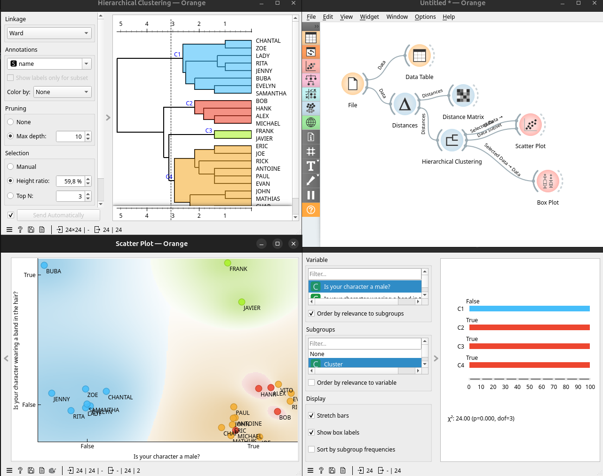
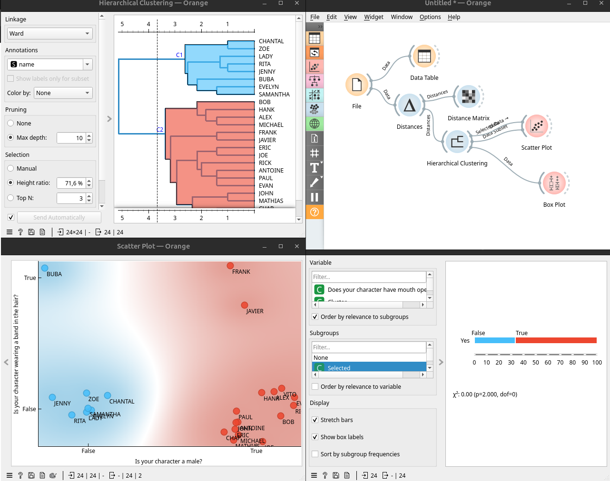
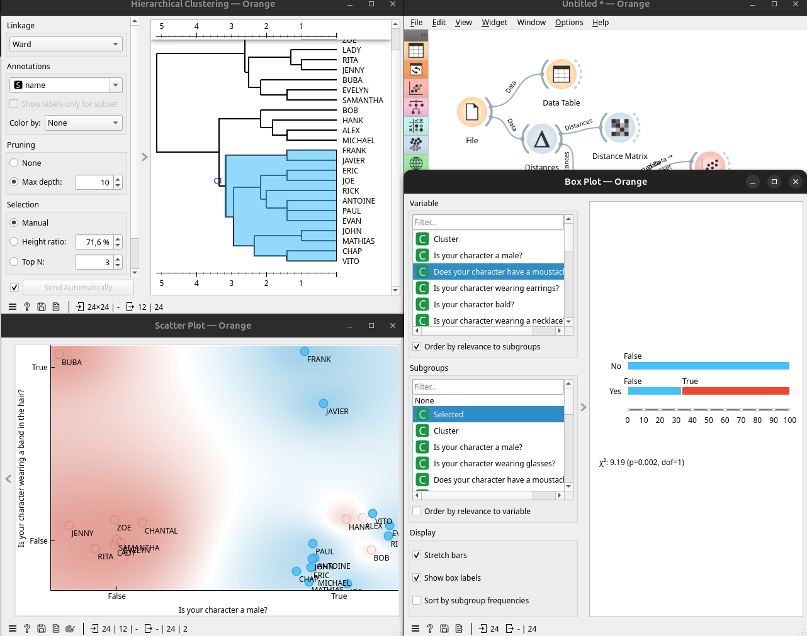

Tenim el dataset de contestacions a preguntes del `Quien es Quien` en anglés 

El posem en Orange, calculen les distàncies. Com son variables booleanes Orange considerarà 0 i 1. Fent un `Hierachical Cluster` es veuen 4 clusters diferenciats. Seleccionant tots es veu que el que més afecta és si és home o dona. 

De fet, si dividim en 2, eixa és la primera divisió.

Després hi ha altres factors, entrem per exemple en els homes, que són més, i seleccionem un altre subgrup:

Es veu que en ell estan els homes que tenen bigot, encara que no tots, eixa característica serà la decisiva en el següent subgrup. En eixe subgrup pocs tenen arracades i estan tots els calbs del dataset.

Per tant, segons aquesta classificació, és millor preguntar si és home i en cas afirmatiu si té bigot. Es tracta de les variables amb millor capacitat de partició de les dades. Amés, en el `Box Plot` té un x² molt alt. Aixo vol dir que defineix clarament un grup. 