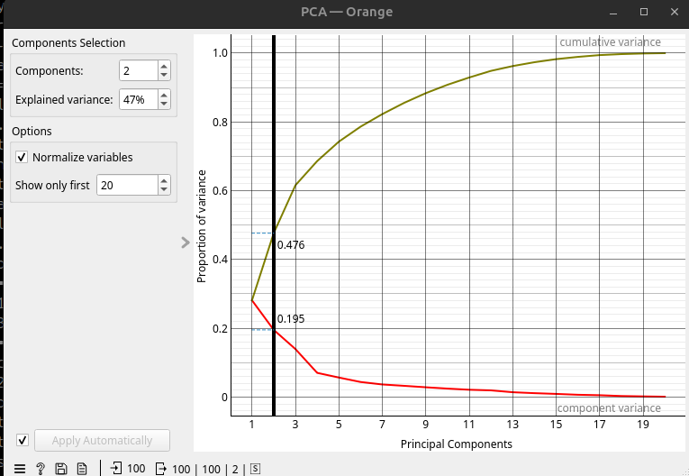
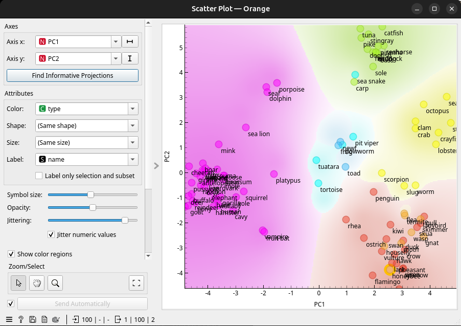
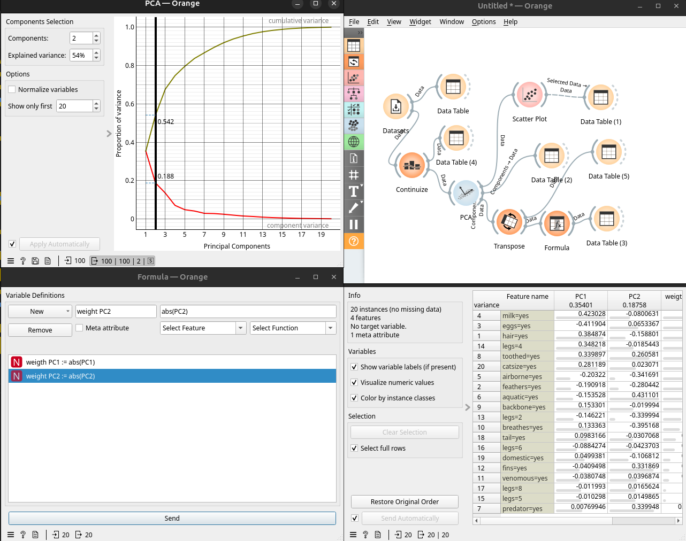
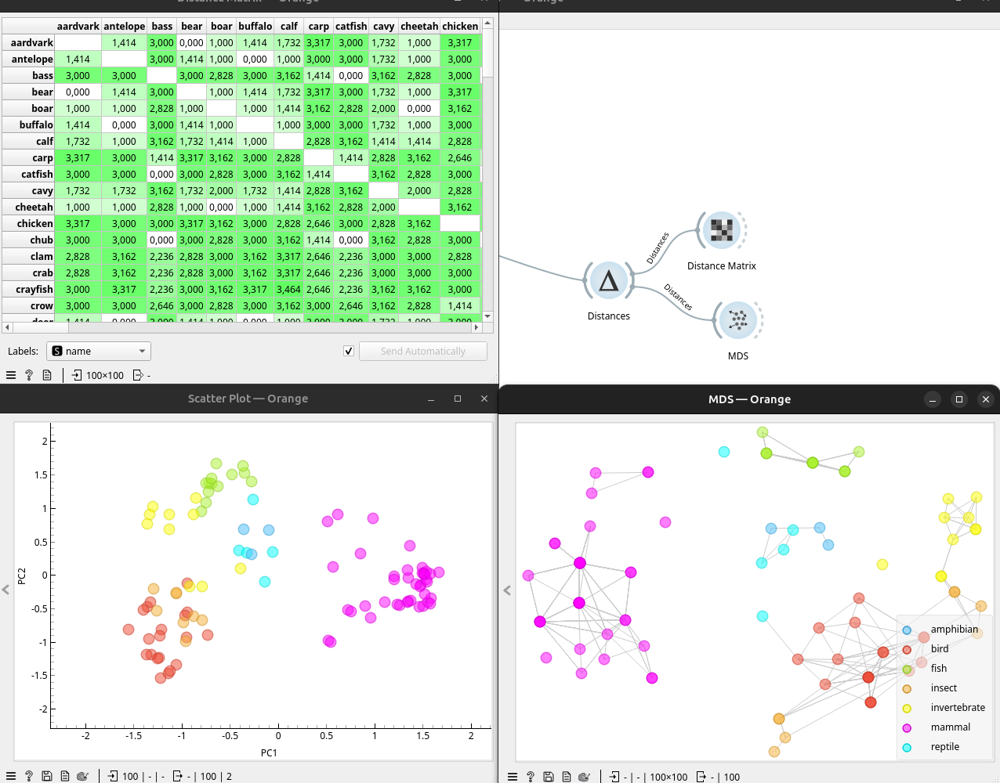
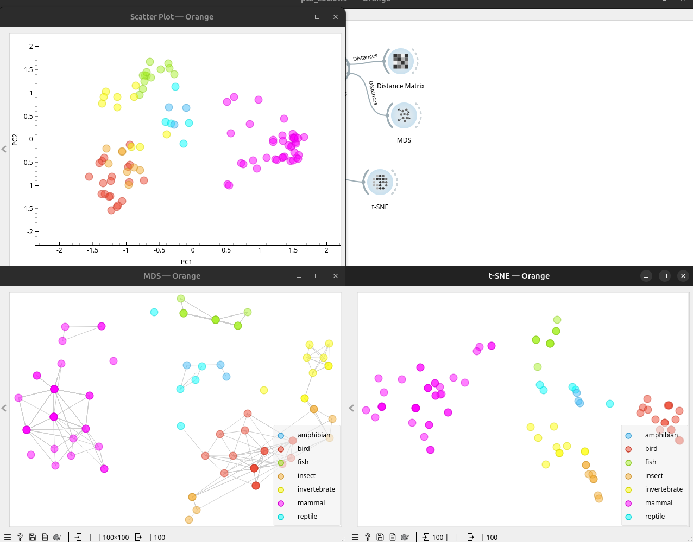
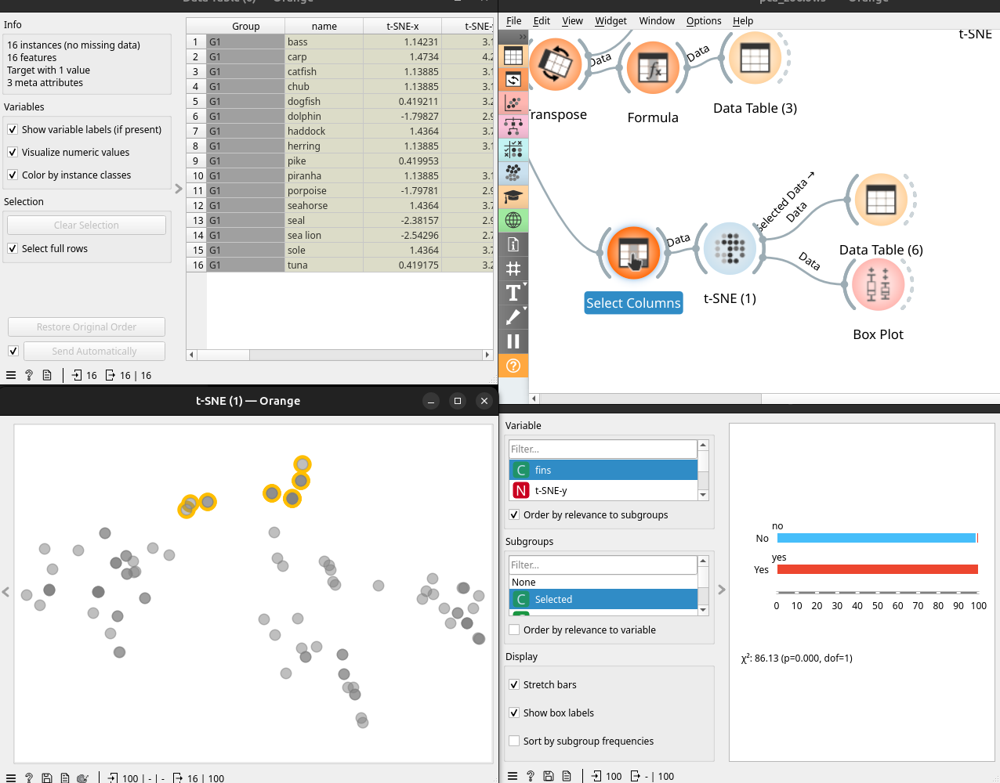

# Reducció de dimensionalitat

## PCA

Anem a utilitzar el `Dataset` de `Zoo` amb característiques booleanes dels animals. 

El tipus d'animal és el `target` i el nom és `meta`, ja que no aporta res a la classificació. 

Si li connectem `PCA` ens deixarà convertir les 16 dimensions yes/no en moltes menys. La questió és detectar quantes donen una informació significativa. 

Si reduïm a 2 components, que expliquen el 47% de la varianza, significa que s'està fent una compressió amb perduda d'informació. Per a fer prediccions és un mal resultat, però per a dibuixar un `Scatter Plot` i detectar agrupaments pot ser suficient. 

Eixe 47% en 2 variables és perquè no estan correlacionades. La falta de correlació és bona per a predicció, però no permet fer correctament `PCA`.

Si ho connectem a un `Scatter Plot` veurem unes regions clarament definides i alguns animals d'altres tipus en mig. Si veiem els mesclat tenen cert sentit:

* La serp marina està entre els peixos ja que posa ous, no té pels ni pates i viu a l'aigua. 
* Reptils i anfibis estan totalment mesclats.
* Insectes i aus estan pròxims. 

Després veiem que hi ha animals "molt" del seu tipus i estan a la seua regió i molt lluny d'altres:

* La cabra és molt mamífera
* La tollina és molt peix.
* El pollastre és molt au. 

El agrupament no ha funcionat del tot bé, però li trobem el sentit.

### Explicació del PCA

https://towardsdatascience.com/pca-clearly-explained-how-when-why-to-use-it-and-feature-importance-a-guide-in-python-7c274582c37e/ 

Si les variables tenen una correlació, el PCA transforma les dades en menys variables no correlacionades. 

S'utilitza per reduir les variables abans de fer un model si hi ha multi-colinealitat i fer el model més lleuger. També pot ser utilitzar per llevar soroll i comprimir dades. O en aquest cas, per representar una classificació en 2 dimensions.

https://www.youtube.com/watch?v=1i4pAQHrSQY&list=PLmNPvQr9Tf-b_SuBdoRsuNhTmaHJ0eKab&index=13

Amb aquesta sequüència podem veure quines variables afecten més al PCA. Primer utilitzem `Continuize` per transformar a numèric (en realitat PCA ja ho fa implicitament). Després passem les dades a `PCA` per treue 2 variables que expliquen el 54%. A continuació es transposen i es treu l'absolut dels components per veure els que tenen més pés. Es veu que `milk` és decisiu seguit de `eggs` i `hair`. Té sentit perquè separa el mamífers dels que posen ous i després els que tenen pels dels que no. Són característiques més definitòries que, per exemple, si és un depredador (que estan en tots els tipus).

## Multidimensional Scaling

Si connectem les dades a `Distances` i a una `Distance Matrix` també conseguirem una manera de representar en 2D aquest espai multidimensional. 

Amb `MDS` ens mostra una representació válida com la del PCA:

La diferència és que el PCA intenta conservar la variança i el MDS les distàncies entre parells. PCA és una projecció en menys dimensions i MDS optimitza la posició dels elements iterativament. 

Si calculem les distàncies en el espai multidimensional entre dos punts, aquesta distància es pot representar en dos dimensions. El problema és quan hi ha més punts i cal representar la distancia entre tots de forma correcta però en 2D. El que fa es començar en llocs que semblen correctes (PCA), calcular distàncies i minimitzar la suma de les diferències de distància al quadrat (per a que siga positiu). Això ho fa iterativament fins que no troba millores significatives. Si comença en llocs aleatoris pot no trobar solucions tant óptimes com si comença on un PCA li diu. 

El visualitzador d'Orange ens permet desordenar els punts i veure com va millorant en cad iteració. 

## t-Distributed Stochastic Neighbor Embedding

`tSNE` és una altra manera de visualitzar grups per distàncies, però dona més importància les distàncies curtes. 

> Per exemple, 2 km més de distància si vaig caminant a treballar és molt més important que 2 km si vaig a París en avió.

Com el seu no indica es tracta d'un `Embedding`, això vol dir una representació en menys dimensions de la informació. Potencia els punts pròxims, per això es diu `Neighbor` i té un component `Stochastic` perque inicialitza amb punts aleatoris. La `t` és per `t-distribution`, que s'utilitza per calcular la importància de cada veí. Mentre que `MDS` preserva les distàncies, `t-SNE` preserva els veins de cada punt.

En aquesta imatge es veu la diferencia entre `PCA`, `MDS` i `t-SNE`. PCA fa grups més compactes però amb errades, MDS separa prou bé, però dispersa els grups i t-SNE és el que millor ha funcionat en aquest cas. PCA ha tingut un problema al representar sols poc més del 50% de la variança, segurament per tenir variables poc correlacionades. 

El funcionament inicial és paregut al MDS, però prioritza mantenir les distàncies dels veins. En Orange també es pot veure la simulació i modificar l'exageració, que encara junta més els grups.

## Data maps

Imaginem que no tenim la columna del tipus i, per tant, no tenim un `target` al dataset. Igualment es pot fer un `t-SNE` i passar a un `Box Plot` per veure les variables que més afecten a un grup seleccionat de punts. (Ara no tenen color). 

## Resum de la reducció de dimensionalitat. 

Per a fer gràfics visualment molt clars, `t-SNE` és el més efectiu. `MDS` manté totes les distàncies, així que pot no ser tan clar, però és més real. `PCA` per la seua part, és un reductor de dimensionalitat matematicament robust i útil per a entrenar models, reduir variança o comprimir dades. 

MDS o t-SNE no son bons per al entrenament, ja que no permeten clavar noves dades sense cambiar el mapa. PCA és una fórmula matemàtica consistent que s'aplica a noves dades o dades de test sense problemes. 

Aquests algorismes NO són de clusterització, són per a projectar dades i visualitzar-les o utilitzar aquesta projecció per a posteriors anàlisis. Poden ser bons aliats en l'anàlisi previ per detectar visualment patrons. 

