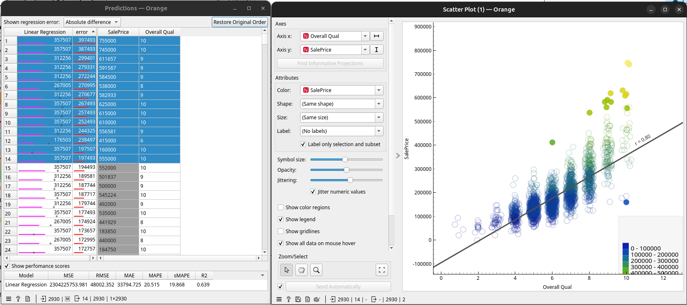
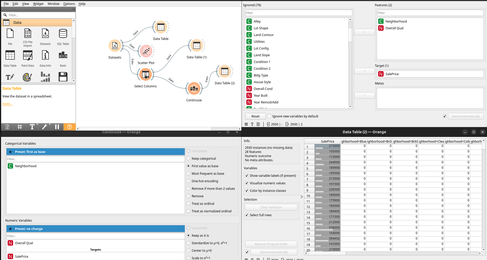
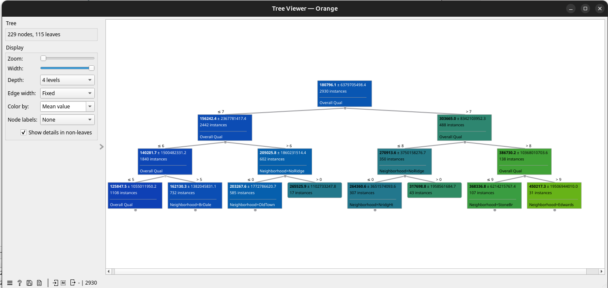

# Regressió en Orange

Anem a treballar en una simplificació del dataset dels preus de les cases en Iowa. 

## Regressió lineal simple

Per a poder representar en una gràfica 2D la regressió ens quedarem en la variable més representativa que és `Overall Qual`. Ho averigüem amb `Correlations` i ho pdem representar en un `Scatter Plot`. 

La regressió lineal no necessita ni ser entrenada en Orange per a visualitzar la línia, sols marcar `Show Regression Line` al `Scatter Plot`. Ens mostra `r` que és el `coeficient de correlació` Que indica la força de la relació lineal. 

Si connectem a `Linear Regression`, de ahí a `Predictions` i les prediccions seleccionades a un altre `Scatter Plot` Podem analitzar si segueixen la línia, les que més errors tenen...

El indicador `R2` és 0.639. 

## Regressió lineal polinòmica

Carreguem el dataset i veurem una gran quantitat de columnes. Algunes poden no ser explicatives o faltar dades, així que ens quedarem amb les dos columnes més significatives per poder representar gràfiques en 2D. Si fem un Scatterplot i polsem en `Find Informative Projections` ens recomana les dimensions: `Neighborhood, Overall Qual` com a les més representatives del preu final. 

La qualitat total és numèric però discret. El Neighborhood és categòric. En el cas d'Orange ja farà el `One-Hot Encoding` internament, però en un problema de regressió cal convertir de categòric a numèric i en aquest cas són noms de barris. Per a fer-ho més explícit utilitzarem el widget `Continuize`

Si ho connecte al predictions ens dona un `R2` de 0.72. Millor que l'anterior, però si ho connectem amb el 'Scatter Plot' i anem seleccionant aquells a més error, les cases més cares tenen més error independentment del barri. 

## Tree

Amb la mateixa selecció de columnes podem calcular les prediccions amb la qualitat i el barri. Com que són més de 16 barris no funcionarà sense `Continuize`, però amb menys no faria falta. 

> A diferència d'Orange (que pot gestionar una mica més el tipus de variable segons el giny), scikit-learn és una llibreria matemàtica estricta i llançarà un error si intenta calcular matrius amb columnes de text o categories de tipus string.

El resultat és 0.79, un poc millor. Observem un fragment del tree resultant per veure com influeix el barri en el preu:

La visualització del tree s'ha retallat molt per a la captura, però es veu que les primeres branques miren sols la qualitat i després van seleccionant per barri. 

En les cases amb errors més extrems sí que pareix que el tree té un error menor al tenir en compte de forma individual el barri, ja que alguns poden tenir casuístiques particulars. 

En `Random Forest` tampoc millora molt.

## kNN

Aquest algorisme fa prediccions per distàncies. El resultat no és millor que el tree amb aquestes dos variables. 

Encara que l'algorisme de kNN és molt més eficient, intentarem comparar el seu resultat amb la visualització `MDS`. Com que tenim moltes dimensions al fer el `One hot` tardarà prou en calcular, ho podem parar en un 50% o menys, que el resultat no canviarà molt. 

